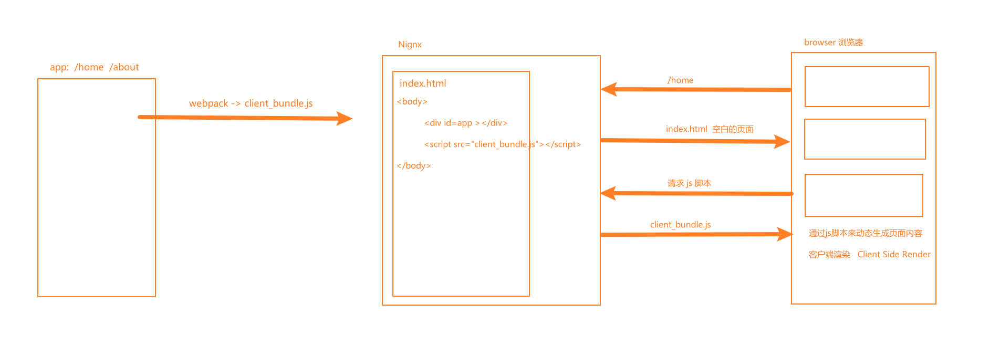
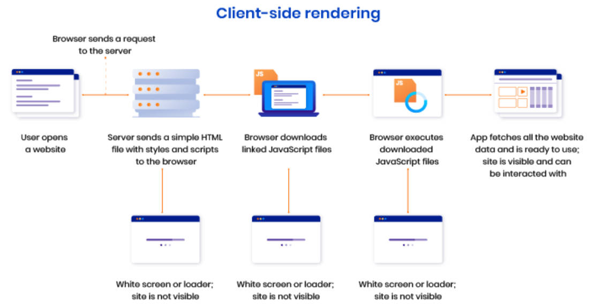
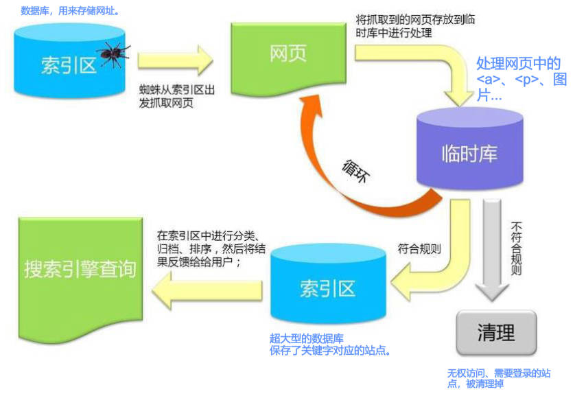

# 邂逅NodeSRR & 从零搭建Vue3+SSR

## 一、学习阶段

1.认识 SPA、CSR、SSG、SSR、ISR、SEO 等概念。理解爬虫的工作流程。

2.从零开始搭建 Vue3 + SSR；认识 Hydration（水合）。

3，Nuxt3 Vue3 => SSR 基础、核心语法，项目实战，集群（cluster）部署

4.从零开始搭建 React + SSR；

3，Nextjs React18 => SSR 基础、核心语法，项目实战，集群（cluster）部署

## 二、单页面富应用（SPA）

单页应用程序 (SPA) 全称是：Single-page application；

SPA 应用，是在**客户渲染的（CRS）**。

SPA 应用，默认只返回一个空 HTML 页面，如：`<body>` 中，只有  `<div id="app"></div>`。

整个应用程序的内容，要通过 JS 动态加载，包括

- 应用程序的逻辑；
- UI 界面；
- 与服务器通信相关的所有数据。

构建 SPA 应用，常见的库和框架有：

- React；
- AngularJS；
- Vue.js。
- ...

单页面富应用（SPA）原理图解：



客户端渲染（CRS，client side rander）原理图解：



### 1.SPA 优点

只需加载一次；

- SPA 应用程序，只需要在第一次请求时加载页面，页面切换不需重新加载；因此，SPA 页面加载速度要比传统 Web 应用程序更快
- 而传统的 Web 应用程序，必须在每次请求时都得加载页面，需要花费更多时间。

更好的用户体验；

- SPA 提供类似于桌面或移动应用程序的体验。用户切换页面不必重新加载新页面；
- 切换页面只是内容发生了变化，页面并没有重新加载，从而使体验变得更加流畅

可轻松的构建功能丰富的 Web 应用程序

### 2.SPA 缺点

SPA 应用，默认只返回一个空 HTML 页面，不利于 SEO（search engine optimization)；这是致命的缺点。

首屏加载的资源过大时，同样会影响首屏的渲染；

不利于构建复杂的项目，复杂 Web 应用程序的大文件可能变得难以维护；

## 三、爬虫工作流程

爬虫（也称蜘蛛），从互联网上发现各类网页， 网页中的外部连接也会被发现。

举例：Google 爬虫的工作流程分为 3 个阶段，并非每个网页都会经历这 3 个阶段：

阶段一：抓取：

- 抓取数以十亿被发现网页的内容，如：文本、图片和视频

阶段二：索引编制：

- 爬虫程序，会分析网页上的文本、图片和视频文件；
- 并将信息存储在大型数据库（索引区）中。
- 例如 `<title>` 元素和 `alt` 属性、图片、视频等；
- 爬虫会对内容类似的网页归类分组。
- 不符合规则内容和网站会被清理
  - 如：禁止访问或 需要权限网站等等

阶段三：呈现搜索结果：

- 当用户在 Google 中搜索时，搜索引擎会根据内容的类型，选择一组网页中最具代表性的网页进行呈现。



## 四、搜索引擎优化（SEO）

要怎样进行搜索引擎优化（SEO，search engine optimization）?

1.多使用语义性 HTML 标记：

- 标题用 `<h1>`，一个页面只有一个；副标题用 `<h2>` 到 `<h6>`。
  - 不要过度使用 h 标签，多次使用不会增加 SEO。
- 段落用 `<p>`，列表用 `<ul>`，并且 `<li>` 只放在 `<ul>` 中
- ...

2.每个页面需包含：标题 + 内部链接

- 每个页面对应的 `<title>`，同一网站，所有页面，都有内链可以指向首页。

3.确保链接可供抓取，如下所示：

- ✔ `<a href="https://example.com">`
- ✔ `<a href="/relative/path/file">`
- ❌ `<a routerLink="some/path">`
- ❌ `<span href="http://example.com>"`
- ❌ `<a onclick="global('http://example.com')">`

4.`<meta>` 标签优化：设置 description keywords 等

5.多用文本标记和 ``：

- 比如 `<b>` 和 `<strong>` 加粗文本的标签，爬虫也会关注到该内容。
- `` 标签添加 `alt` 属性，图片加载失败，爬虫会取 `alt` 内容。

6.`robots.txt` 文件：规定爬虫可访问网站上的哪些网址。

7.`sitemap.xml` 站点地图：列出所有网页，确保爬虫不会漏掉某些网页。

更多 SEO 优化注意事项，查看：[Google文档](https://developers.google.com/search/docs/crawling-indexing/valid-page-metadata)。

理解 SEO 评分规则表格，作为参考。

| HTML 标签               | 含义                                                   | SEO 权重 |
| ----------------------- | ------------------------------------------------------ | -------- |
| `<title>`               | 标题                                                   | 10 分    |
| `<a>`                   | 内部链接文字                                           | 10 分    |
| `<h1>`/`<h2>`           | 标题，其实是 h1-h6，其中 `<h1>` 和 `<h2>` 是最重要的； | 5 分     |
| `<p>`                   | 每段首句                                               | 5 分     |
| `<p>`                   | 每句开头                                               | 1.5 分   |
| `<b>`/`<string>`        | 加粗                                                   | 1 分     |
| `<a title=''>`          | title 属性                                             | 1 分     |
| ``          | img alt 标记                                           | 0.5 分   |
| `<meta description=''>` | meta 标签的网站 description                            | 0.5 分   |
| `<meta keywords=''>`    | meta 标签的网站 keywords                               | 0.05 分  |

哪些页面是利于 SEO 的呢？

## 五、静态站点生成（SSG）

静态站点生成（SSG，static site generator）是什么？

SSG 的优点和缺点。


适用场景：

例如说明文档，博客...这样的静态站点。

---

服务器端渲染（SSR，Server side render）是什么。

理解 Vue3 + SSR 生成静态文件的图解。

理解 Vue3 + SSR hydration 的图解。


SSR 的优点和缺点。

---

SSR 解决方案。

三种方案：


应用场景

---

邂逅 Vue3 + SSR

创建 01-... 项目；

初始化项目：

```shell
pnpm init
```

---

Node Server 的搭建。

安装依赖 express、

```shell
pnpm add express
```

安装开发时依赖 nodemon、webpack、webpack-node-externals

```shell
pnpm add webpack webpack-cli webpack-node-externals nodemon -D
```

创建 exoress 服务器。

01-node-server\src\server\index.js

```js
const express = require('express')

const app = express()

app.get('/home', (req, res, next) => {
  res.send(`Hello Node Server`)
})

app.listen(9000, () => {
  console.log('start node server on port 9000 ~')
})
```

配置启动服务的脚本：

01-node-server\package.json

```json
{
  "scripts": {
    "start": "nodemon ./src/server/index.js"
  },
}
```

编写 webpack 配置文件，对服务进行打包

01-node-server\src\config\webpack.config.js

```js
const path = require('path')

module.exports = {
  target: 'node',
  mode: 'development',
  entry: './src/server/index.js', // 相对于项目运行的目录。
  output: {
    filename: 'server_bundle.js',
    path: path.resolve(__dirname, '../build/server')
  }
}
```

在 webpack 配置文件中，配置打包服务端代码的命令。

```json
{
  "scripts": {
    "dev": "nodemon ./src/server/index.js",
    "build:server": "webpack --config ./config/webpack.config.js --watch" // 项目文件改变后，重新打包
  },
}
```

执行命令，打包

```shell
pnpm build:server
```

发现打包的结果太大；

因为打包的是 node 环境，所以要配置 webpack，排除 webpack-node-externals 的打包。

01-node-server\src\config\webpack.config.js

```js
const path = require('path')
const nodeExternals = require('webpack-node-externals')

module.exports = {
  target: 'node',
  mode: 'development',
  entry: './src/server/index.js', // 相对于项目运行的目录。
  output: {
    filename: 'server_bundle.js',
    path: path.resolve(__dirname, '../build/server')
  },
  externals: [nodeExternals()]
}
```

配置命令 start，用于运行打包后的服务端代码。

```json
{
  "scripts": {
    "dev": "nodemon ./src/server/index.js",
    "start": "nodemon ./build/server/server_bundle.js",
    "build:server": "webpack --config ./config/webpack.config.js --watch"
  },
}
```

---

Vue App 搭建

将 App.vue 转成字符串，放入到 Node Server 中。

拷贝 01-... 项目，重命名为 02-... 项目。

在其中还要安装依赖：vue

```shell
pnpm add vue
```

安装开发时依赖 vue-loader、babel-loader、@babel/preset-env、webpack-merge

```shell
pnpm add vue-loader babel-loader @babel/core @babel/preset-env webpack-merge -D
```

编写一个 `App.vue` 文件。

02-vue3-ssr\src\App.vue

```vue
<script setup>
import { ref } from 'vue';

const count = ref(100)
const onAddButtonClick = () => count.value++

</script>

<template>
  <div class="app" style="border: 1px solid red;">
    <h1>Vue3 app</h1>
    <div>{{ count }}</div>
    <button @click="onAddButtonClick">+1</button>
  </div>
</template>

<style scoped>
</style>
```

创建 Vue3 的入口，

02-vue3-ssr\src\app.js

```js
import { createSSRApp } from 'vue';
import App from './App.vue';

// 导出一个函数，在其中中返回 app 实例。
// 避免跨请求状态的污染。
// 保证每个请求，都会返回一个新的 app 实例。
export default function createApp() {
  const app = createSSRApp(App)
  return app
}
```

在 webpack 配置文件中，配置扩展名：

02-vue3-ssr\config\webpack.config.js

```js
const path = require('path')
const nodeExternals = require('webpack-node-externals')

module.exports = {
  target: 'node',
  mode: 'development',
  entry: './src/server/index.js', // 相对于项目运行的目录。
  output: {
    filename: 'server_bundle.js',
    path: path.resolve(__dirname, '../build/server')
  },
  resolve: {
    extenstions: ['.js', '.json', 'wasm', '.jsx', '.vue']
  },
  externals: [nodeExternals()]
}
```

在 Node Server 的入口文件中，引入 app 实例。

将 app 实例，转成字符串。

02-vue3-ssr\src\server\index.js

```js
const express = require('express')
import createApp from '../app';
import { renderToString } from 'vue/server-renderer';

const server = express()

server.get('/', async (req, res, next) => {
  const app = createApp()
  const appHtmlString = await renderToString(app)

  res.send(`<!DOCTYPE html>
  <html lang="en">
  <head>
    <meta charset="UTF-8">
    <meta http-equiv="X-UA-Compatible" content="IE=edge">
    <meta name="viewport" content="width=device-width, initial-scale=1.0">
    <title>Document</title>
  </head>
  <body>
    <h1>Vue3 Serve Side Render</h1>
    <div id="app">
      ${appHtmlString}
    </div>
  </body>
  </html>`)
})

server.listen(9000, () => {
  console.log('start node server on port 9000 ~')
})
```

在 webpack 配置文件中，配置 loader

修改 `webpack.config.js` 名称为 `webpack.server.config.js`；

02-vue3-ssr\config\webpack.server.config.js

```js
const path = require('path')
const nodeExternals = require('webpack-node-externals')
const { VueLoaderPlugin } = require('vue-loader/dist/index')

module.exports = {
  target: 'node',
  mode: 'development',
  entry: './src/server/index.js', // 相对于项目运行的目录。
  output: {
    filename: 'server_bundle.js',
    path: path.resolve(__dirname, '../build/server')
  },
  resolve: {
    extensions: [".js", ".json", ".wasm", ".jsx", ".vue"],
  },
  module: {
    rules: [
      {
        test: /\.js$/,
        loader: 'babel-loader',
        options: {
          presets: ['@babel/preset-env']
        }
      },
      {
        test: /\.vue$/,
        loader: 'vue-loader'
      }
    ]
  },
  plugins: [new VueLoaderPlugin()],
  externals: [nodeExternals()]
}
```

执行命令打包

```shell
pnpm build:server
```

执行命令，开启本地服务

```shell
pnpm start
```

访问 localhost:9000

静态资源被展示，但不能点击按钮交互。

至此，同构应用的服务端搭建，已经完成

接下来要进行 hydration。也就是搭建客户端，新建 client 文件夹。