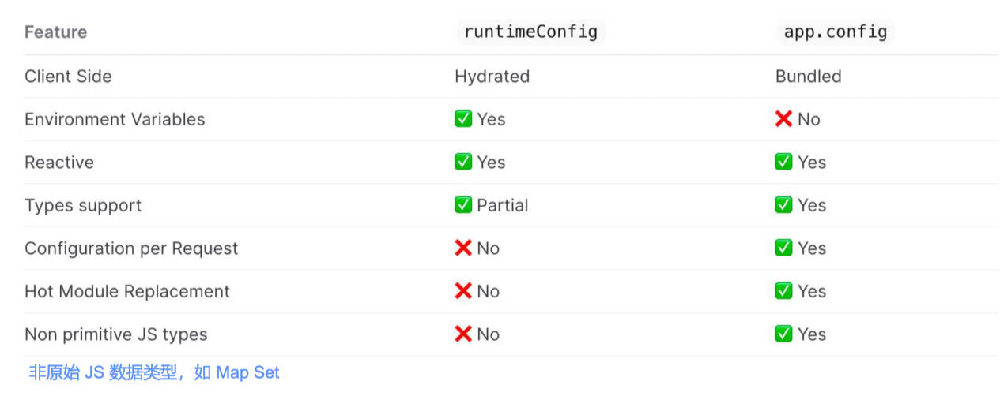

# Nuxt3配置 & 渲染模式 & 内置组件 & 样式和字体图标 & 路由导航

## 一、nuxt.config.js

### 1.appConfig 配置

定义项目在构建时的公共变量，

- 比如：theme

`nuxt.config.ts` 中的 `appConfig` 配置，会和 `app.config.ts` 的配置合并。

优先级 `app.config.ts` > `nuxt.config.ts -> appConfig`；

`nuxt.config.js` 中，配置 `appConfig`；

demo-project\03-hello-nuxt\nuxt.config.ts

```js
export default defineNuxtConfig({
  appConfig: {
    title: "Hello Nuxt3 ZZT",
    theme: {
      primary: 'yellow'
    }
  }
})
```

在 `app.vue` 中，读取 `appConfig` 的配置。

demo-project\03-hello-nuxt\app.vue

```vue
<script setup>
// 获取 appConfig
const appConfig = useAppConfig() //不需要导包

// 在 server 和 client 两端，都可以使用。
console.log('appConfig.title:', appConfig.title)
console.log('appConfig.theme.primary:', appConfig.theme.primary)

// 生命周期钩子，只会在客户端运行。
onMounted(() => {
  document.title = appConfig.title
})
</script>
```

将 `nuxt.config.ts` 中的 `appConfig` 的配置，抽取到 `app.config.ts` 文件中。

demo-project\03-hello-nuxt\app.config.ts

```js
export default defineAppConfig({
  title: 'Hello Nuxt3 ZZT',
  theme: {
    primary: 'yellow'
  }
})
```

#### 1.与 runtimeConfig 区别

runtimeConfig 和 appConfig 都用于为应用程序定义变量；

`runtimeConfig`：定义环境变量，

- 比如：项目运行时，需要指定的私有或公共 token。

`appConfig`：定义公共变量。

- 比如：项目构建时，确定的公共 token、网站配置。



### 2.app 配置

用于给每个页面设置 head 信息，做 SEO 优化，

- 也支持用 `useHead` 函数，进行配置，
- 也支持内置组件，进行配置。

这些配置，对所有后端渲染的页面生效。

在 `nuxt.config.ts` 中，配置 `app`；

demo-project\03-hello-nuxt\nuxt.config.ts

```js
// https://nuxt.com/docs/api/configuration/nuxt-config
export default defineNuxtConfig({
  app: {
    head: {
      title: 'ZZT',
      charset: 'UTF-8',
      viewport: 'width=device-width, initial-scale=1.0, maximum-scale=1.0, minimum-scale=1.0, user-scalable=no',
      meta: [
        {
          name: 'keywords',
          content: 'ZZT SEO'
        },
        {
          name: 'description',
          content: '手机商城 zzt'
        }
      ],
      link: [
        {
          rel: 'shortcut icon',
          href: 'favicon-ico',
          type: 'image/x-icon'
        }
      ],
      style: [
        {
          children: 'body { color: red; }'
        }
      ],
      script: [
        {
          src: 'http://codercba.com'
        }
      ]
    }
  }
})
```

在 `app.vue` 页面中，使用 `useHead`，为单个页面，覆盖以上配置：

详见[官方文档](https://nuxt.com/docs/api/composables/use-head)。

demo-project\03-hello-nuxt\app.vue

```vue
<script setup>
// 动态的覆盖 nuxt.config.ts 中，app 的配置。
useHead({
  title: 'app useHead',
  meta: [
    {
      name: 'desc',
      content: 'ABCDEFG'
    }
  ],
  bodyAttrs: {
    class: 'zzt'
  },
  // 也支持以下的配置：
  style: [],
  link: [],
  script: [
    {
      src: 'http://codercba.com',
      body: true
    }
  ],
})
</script>
```

在 `app.vue` 中，也可以使用 Nuxt 的**内置组件**，来进行配置。

demo-project\03-hello-nuxt\app.vue

```vue
<template>
  <div>
    <h2>Hello Nuxt3</h2>
    <Head>
      <Meta name="key" content="key key key"></Meta>
    </Head>
  </div>
</template>
```

优先级：内置组件 > useHead > nuxt.config.js

### 3.ssr 渲染模式配置

指定应用渲染模式（SSR or CSR）：

demo-project\03-hello-nuxt\nuxt.config.ts

```typescript
export default defineNuxtConfig({
  ssr: false // 默认为 true
})
```

### 4.router 配置

配置路由相关的信息；

- 在 CSR 渲染模式下，可以配置 hash 模式路由。
- 在 SSR 渲染模式下，只能使用 history 模式路由。

配置 `ssr: false`，才能使用 Hash 模式。

demo-project\03-hello-nuxt\nuxt.config.ts

```js
export default defineNuxtConfig({
  ssr: false,
  router: {
    options: {
      hashMode: true
    }
  }
})
```

## 二、Nuxt3 内置组件

Nuxt3 框架也提供一些内置的组件，常用的如下：

- 用于 SEO 的组件： `<Html>`、`<Body>`、`<Head>`、`<Title>`、`<Meta>`、`<Style>`、`<Link>`、`<NoScript>`、`<Base>`
- `<NuxtWelcome>`：欢迎页面组件，该组件是 *@nuxt/ui* 的一部分 。
- `<NuxtLayout>`：Nuxt 自带的页面布局组件。
- `<NuxtPage>`：Nuxt 自带的路由占位组件。
  - 用于显示位于目录中的顶级或嵌套页面 `/pages`；
  - 是对 `<router-view>` 的封装。
- `<ClientOnly>`：该组件中，默认插槽的内容，只在客户端渲染。
  - 在 `fallback` 插槽的内容，只在服务器端渲染。
- `<NuxtLink>`：Nuxt 自带的页面导航组件
  - 是 Vue Router `<router-link>` 组件和 HTML `<a>` 标签的封装。
- ...

详见[官方文档](https://nuxt.com/docs/getting-started/seo-meta#components)。

### 1.NuxtPage 组件

创建 `/pages` 目录，在其中创建 `index.vue` 页面。

demo-project\03-hello-nuxt\pages\index.vue

```vue
<script setup lang="ts">
</script>

<template>
  <div class="home">
    <h1>home</h1>
    <p>我是 Home Page</p>
  </div>
</template>

<style scoped lang="less">
</style>
```

此时页面会报错，这是因为，创建的页面，自动生成了路由。

在 `app.vue` 中，添加路由占位。

demo-project\03-hello-nuxt\app.vue

```vue
<template>
  <div>
    <h2>Hello Nuxt3</h2>
    <NuxtPage></NuxtPage>
  </div>
</template>
```

### 2.ClientOnly 组件

指定内容只在客户端渲染。

浏览器请求下来的 html 静态资源，不会包含其中的内容。而是动态渲染（由加载的 JS 来渲染）。

demo-project\03-hello-nuxt\pages\index.vue

```vue
<template>
  <div class="home">
    <h1>home</h1>
    <p>我是 Home Page</p>

    <ClientOnly fallback-tag="h3" fallback="Loading...">
      <p>我只会在 client 渲染~</p>
    </ClientOnly>

    <ClientOnly>
      <p>我只会在 client 渲染~</p>
      <template #fallback>
        <h3>Loading...</h3>
      </template>
    </ClientOnly>
  </div>
</template>
```

## 三、全局样式

### 1.方式一：app.vue

在 `app.vue` 中，编写全局样式。

demo-project\03-hello-nuxt\app.vue

```vue
<stylew>
.global-style {
  color: red;
}
</stylew>
```

在页面中使用。

demo-project\03-hello-nuxt\pages\index.vue

```vue
<template>
  <div class="home">
    <h1>home</h1>
    <p class="global-style">我是 Home Page</p>
  </div>
</template>
```

### 2.方式二：assets

在 `/assets` 目录下，创建 `/styles` 目录，在其中创建 `main.css`。

demo-project\03-hello-nuxt\assets\styles\main.css

```css
/* 全局杨思 */
.global-style1 {
  color: green;
}
```

在 `nuxt.config.ts` 中，配置 `css` 选项：

demo-project\03-hello-nuxt\nuxt.config.ts

```js
export default defineNuxtConfig({
  css: [
    '@/assets/styles/main.css'
  ]
})
```

### 3.sass、less 支持

安装 less

```shell
pnpm add sass less -D
```

在 `/assets` 目录下，编写 `main.less`；

demo-project\03-hello-nuxt\assets\styles\main.less

```less
// 全局样式
@color: blue;

.global-style2 {
  color: @color;
}
```

在 `nuxt.config.js` 中，配置 css 选项：

demo-project\03-hello-nuxt\nuxt.config.ts

```js
// https://nuxt.com/docs/api/configuration/nuxt-config
export default defineNuxtConfig({
  css: [
    '@/assets/styles/main.css',
    '@/assets/styles/main.less'
  ]
})
```

在页面中应用全局样式。

demo-project\03-hello-nuxt\pages\index.vue

```vue
<template>
  <div class="home">
    <p class="global-style2">哈哈哈哈哈哈哈哈哈哈哈</p>
  </div>
</template>
```

### 4.全局变量

#### 1.手动导入

手动导入全局变量的使用：

在 `assets` 中，编写样式的变量。

demo-project\03-hello-nuxt\assets\styles\variable.less

```less
// 定义全局的SCSS变量
@fsColor: purple;
@fs20: 20px;

// 混合
.border {
  border: 1px solid red;
}
```

在页面中，引入定义变量的文件，并应用变量。

demo-project\03-hello-nuxt\pages\index.vue

```vue
<template>
  <div>
    <p class="style-variable">样式变量应用。</p>
  </div>
</template>

<style scoped lang="less">
@import url('@/assets/styles/variable.less');

// scss 的语法
// @use 有名命空间，@import 没有。
// - as vb: 给这个模块起一个命名空间。
// - as * : 可以省略命名空间。
// @use "~/assets/styles/variable.less" as bv;
// @use "~/assets/styles/variable.less" as *;

.style-variable {
  color: @fsColor;
  font-size: @fs20;
  .border()
}
</style>
```

#### 2.自动导入

自动导入全局变量：

详见[官方文档](https://nuxt.com/docs/getting-started/assets#global-styles-imports)，用于导入 scss 样式。

会在每个 scss 作用域，自动导入变量。

## 四、资源导入

### 1.public 目录

其中的静态资源，可在应用程序上，直接通过 URL 访问

- 比如：`public/img/nuxt.png` 中的图像资源，可用 `"/img/nuxt.png"` 引入；

- 也支持在 css 背景中使用。

访问 public 资源：

在 public 目录下，放入一张图片 `user.png`。

在 `app.vue` 中，访问该资源。

demo-project\03-hello-nuxt\app.vue

```vue
<template>
  <div>
    
    <div class="bg-publick"></div>
  </div>
</template>

<style>
.bg-publick {
  width: 200px;
  height: 200px;
  border: 1px solid red;
  background-image: url(/user.png);
}
</style>
```

### 2.assets 目录

assets 经常用于存放样式表、字体、SVG 的资源。

可用 `@/assets/` 路径，引用位于 assets 目录中的资产文件。同样支持在背景中使用。

访问 assets 里的资源。

demo-project\03-hello-nuxt\app.vue

```vue
<template>
  <div>
    
    <div class="bg-publick"></div>
  </div>
</template>

<style>

.bg-publick {
  width: 200px;
  height: 200px;
  border: 1px solid red;
  background-image: url(@/assets/images/avatar.png);
}
</style>
```

使用 `import` 导入 assets 里的资源：

demo-project\03-hello-nuxt\app.vue

```vue
<script setup>
import avatarPng from '@/assets/images/avatar.png';
</script>

<template>
  
</template>
```

也可以使用 base64, 网络 url 等形式的图片。

## 五、字体图标

字体图标使用步骤：

1. 将字体图标，存放在 `/assets` 目录下。
3. 在 `nuxt.config.ts` 配置文件中，进行配置；导入全局样式。
4. 在页面中使用字体图标。

在 iconfont 上，下载字体图标。

放入到 `/assets/iconfont` 目录下。

在 `nuxt.config.js` 里，进行配置：

demo-project\03-hello-nuxt\nuxt.config.ts

```js
export default defineNuxtConfig({
  css: [
    '@/assets/iconfont/iconfont.css'
  ]
})
```

在 `app.vue` 中，使用字体图标。

demo-project\03-hello-nuxt\app.vue

```html
<!-- 资源导入：字体图标 -->
<i class="iconfont icon-shouye"></i>
```

## 六、新建页面

Nuxt 项目中，应在 `/pages` 目录下创建页面。

Nuxt 会根据该页面的目录结构、和其文件名，自动生成**约定式的路由**。

方式一：在 `/pages` 目录下，创建一个页面 `category.vue`。

demo-project\03-hello-nuxt\pages\category.vue

```vue
<script setup lang="ts">
</script>

<template>
  <div class="category">
    <h1>category</h1>
  </div>
</template>

<style scoped lang="less">
</style>
```

> 在 Nuxt 中：
>
> `<NuxtPage>` 是对 `<router-view>` 的封装。
>
> `<NuxtLink>` 是对 `<router-link>` 的封装。

在 `app.vue` 中，编写路由的按钮，路由的占位。

demo-project\03-hello-nuxt\app.vue

```vue
<template>
  <div>
    <NuxtLink to="/">
      <button>home</button>
    </NuxtLink>

    <NuxtLink to="/category">
      <button>category</button>
    </NuxtLink>

    <!-- 路由的占位 -->
    <NuxtPage></NuxtPage>
  </div>
</template>
```

方式二：在 `pages/cart` 目录下，创建 `index.vue`.

demo-project\03-hello-nuxt\pages\cart\index.vue

```vue
<script setup lang="ts">
</script>

<template>
  <div class="cart">
    <h1>cart</h1>
  </div>
</template>

<style scoped lang="less">
</style>
```

在 `app.vue` 中，编写路由的按钮。

demo-project\03-hello-nuxt\app.vue

```vue
<template>
  <div>
    <NuxtLink to="/cart">
      <button>cart</button>
    </NuxtLink>

    <NuxtPage></NuxtPage>
  </div>
</template>
```

使用命令创建页面：

```shell
npx nuxi add page profile # 创建 profile.vue 页面

npx nuxi add page find/index.vue # 在 pages/find 目录下，创建 index.vue 页面。
```

## 七、组件导航

`<NuxtLink>` 是 Nuxt 内置组件，用来实现路由导航；它是对 vue-router 的 `<router-link>` 的扩展：

底层是一个 `<a>` 标签，因此使用 `<a href='xxx'>` 也支持路由导航。

- 这么做，会触发浏览器刷新事件，而 `<NuxtLink>` 不会；

Hydration 后（已激活，可交互），页面导航，会通过前端路由来实现。这可以防止整页刷新。

`<NuxtLink>` 组件属性：

- `to`：支持路由路径、路由对象、URL；
- `href`：to 的别名；
- `replace`：默认为 false，是否替换当前路由；
- `activeClass`：激活链接的类名；
- `target`：和 a 标签的 target 一样，指定何种方式显示新页面；
- ...

`<NuxtLink>` 组件的 `to` 属性，支持接收一个对象。

demo-project\03-hello-nuxt\app.vue

```vue
<NuxtLink :to="{
  path: '/category',
  query: {
    id: 10
  }
}">
  <button>category</button>
</NuxtLink>
```

测试 `activeClass`、`replace` 属性。

demo-project\03-hello-nuxt\app.vue

```vue
<template>
  <div>
    <NuxtLink to="/cart" active-class="haha" :replace="true">
      <button>cart</button>
    </NuxtLink>
  </div>
</template>

<script setup>
.haha button {
  color: red;
}
</script>
```

### 1.外部地址

`<NuxtLink>` 组件的 `to` 属性，支持接收一个外部的地址。

- 此时，推荐添加 `external` 属性；默认 Nuxt 会帮助添加。

demo-project\03-hello-nuxt\app.vue

```vue
<NuxtLink to="https://www.jd.com" target="_blank" external>
  <button>js.com</button>
</NuxtLink>
```

渲染出的 `<a>` 会加入如下属性：表示不会把本站点的信息，带入到外部站点。

```html
<a href="http://www.jd.com" rel="noopener noreferrer" target="_blank"></a>
```

## 八、编程导航

### 1.navigateTo

Nuxt3 支持编程导航，通常使用 `navigateTo` 函数。

`navigateTo` 函数，在服务器端、客户端、插件、中间件中都可用，

编程导航不利于 SEO。

可直接调用，以执行页面导航，例如下方案例：

- 当触发 `goToCategory()` 方法时，通过 `navigateTo` 函数，来实现动态导航。
- 建议：方法中，总是 `return navigateTo` 函数（该函数是异步的），或使用 `await navigateTo`；

`navigateTo(to, options)` 函数:

- `to`: 可以是字符串、外部 url、路由对象：
- `options`: 导航配置，可选：
  - `replace`：替换当前路由页面。
  - `external`：默认为 `false`，不允许导航到外部连接，`true` 则允许。
  - ...

demo-project\03-hello-nuxt\app.vue

```vue
<template>
  <h3>编程导航</h3>
  <button @click="goToCategory">category</button>
  <button @click="goToCart">cart</button>
  <button @click="goToJd">JD.com</button>
</template>

<script>
function goToCategory() {
  return navigateTo('/category')
}

function goToCart() {
  return navigateTo({
    path: '/cart',
    query: {
      id: 100
    }
  }, {
    replace: true
  })
}

function goToJd() {
  return navigateTo('https://www.jd.com', { external: true })
}
</script>
```

### 2.useRouter/this.$router

Nuxt3 也支持 Vue3 的 `useRouter`，或者 Options API 的 `this.$router`。

`useRouter` 常用的 API

- `back`：页面返回，同 `router.go(-1)`；
- `forward`：页面前进，同 `router.go(1)`；
- `go`：页面返回或前进，如 `router.go(-1)` or `router.go(1)`；
- `push`：以编程方式导航到新页面。
- `replace`：以编程方式导航到新页面，但会替换当前路由。
- `beforeEach`：路由守卫钩子，每次导航前执行（用于全局监听）
- `afterEac`：路由守卫钩子，每次导航后执行（用于全局监听）

- .....

> 建议改用 `navigateTo` 。支持性更好

路由守卫的使用。

在 `app.vue` 中，使用 `beforeEach` 路由守卫。

demo-project\03-hello-nuxt\app.vue

```vue
<script setup>
const router = useRouter()

router.beforeEach((to, form) => {
  console.log('to:', to)
  console.log('form:', form)
})
</script>
```
