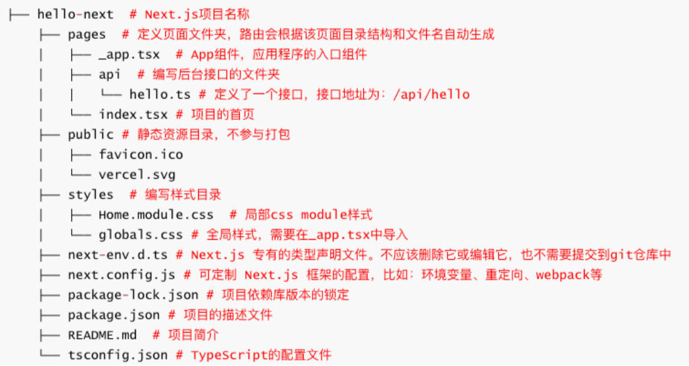

# Nextjs配置 & 内置组件 & 页面

## 一、Next.js 是什么

Next.js 是一个 React 框架，支持 CSR、SSR、SSG、ISR (Incremental Static Regeneration) 等渲染模式。

Next.js 提供了创建 Web 应用程序的构建块，比如：

- 用户界面、路由、数据获取、渲染模式、后端服务、等等。

[中文官网](https://www.nextjs.cn/docs/getting-started)、[英文官网（官网）](https://nextjs.org/docs/getting-started)

## 二、Nest.js 发展史

2016 年 10 月 25 日，Next.js 于首次作为开源项目发布在 GitHub 上，最初是基于以下原则开发的，即：

- 开箱即用、无处不在的 JS、所有函数用 JS 编写、自动代码拆分、服务器渲染、可配置数据获取、预期请求、简化部署。

2017 年 3 月，Next.js 2.0 发布，改进后的版本让小型网站的工作变得更加容易，还提高了构建和热模块替换效率。

2018 年 9 月，Next.js 7.0 版本发布，改进了错误处理，并支持 React 的上下文 API。升级到了 webpack4。

2019 年 2 月，Next.js 8.0 版本发布，第一个提供 Serverless 部署的版本。

2020 年 3 月，Next.js 9.3 版本发布，包括各种优化和全局 Sass 和 CSS 模块支持。

2020 年 7 月 27 日，Next.js 9.5 版发布，增加了“增量静态再生成”（ISR）、重写和重定向支持等新功能。

2021 年 6 月 15 日，Next.js 11 版本发布，其中包括：Webpack 5 支持。

2021 年 10 月 26 日，Next.js 12 发布，添加了 Rust 编译器，使编译速度更快。

2022 年 10 月 26 日，Vercel 发布了 Next.js 13。

- 带来了一种新的路由模式，增加了 app 目录 、布局、服务器组件、一组新的数据获取方法等（目前是 beta 版本）。
- 编译、压缩等由 Babel + Terser 换为 SWC（Speedy Web Compiler）（由 Rust 构建）；
- 构建工具增加了 Turbopack。

## 三、Next.js 的特点

开箱即用，快速创建：

- 已集成好了各种技术栈，比如：React、webpack、路由、数据获取、SCSS、TypeScript、...
- 提供了专门的脚手架：*create-next-app*

约定式路由（目录结构即路由）：

- 路由根据 pages 目录结构自动生成。

内置 CSS module、Sass 支持：

全栈开发能力：

- Next.js 支持前端开发，还支持编写后端代码；
- 比如：可开发登录验证、存储数据、获取数据等接口。

多种渲染模式：支持 CSR、SSR、SSG、ISR 等渲染模式，当然也支持混合搭配使用。

利于 SEO：

- Next.js 支持使用服务器端渲染，同时它也是一个静态站点生成器，利于 SEO 和首屏渲染。

## 四、Next.js VS Nuxt3

Next.js 和 Nuxt3 的相同点：

- 利于 SEO，提高首屏渲染速度；
- 零配置，开箱即用；
- 支持约定式路由、封装了网络请求、支持 TypeScript
- 支持服务器端渲染、静态网站生成、客户端渲染等。
- 需要 Node.js 服务器，支持全栈开发。

Next.js 和 Nuxt3 的不同点：

- Next.js 使用的是 React 技术栈：React、webpack、express、node.....；
- Nuxt3 使用的是 Vue 技术栈：Vue、webpack、vite、h3（http 框架，实现部署可移植性）、nitro（生产环境打包）、node.....。
- Nuxt3 支持组件、组合 API、Vue API 等自动导入;
- Next.js 则不支持。
- Next.js 社区生态、资源和文档，比 Nuxt3 友好（star 数：Nuxt3：41.6k；Next.js：96.8k ）

Next.js 和 Nuxt3 如何选择？

- 首先，根据自己或团队，擅长的技术栈来选择，擅长 Vue 选择 Nuxt3，擅长 React 选择 Next.js；
- 其次，需要更灵活的，选择 Next.js；需要简单易用、快速上手的，选择 Nuxt3。

## 五、Next.js 13 项目创建

环境、开发工具准备：

- Node.js（要求 Node.js 14.6.0 或更高版本）；
- Git（window 下可以用其随附的 Git Bash 终端命令）；
- Visual Studio Code。

创建一个项目，项目名不支持大写：

```shell
# 方式一：
npx create-next-app@latest --typescript

# 方式二：
yarn create next-app --typescript

# 方式三：
pnpm create next-app –typescript

# 方式四：
npm i create-next-app@latest –g && create-next-app
```

运行项目

```shell
npm run dev

yarn dev

pnpm dev
```

## 六、项目目录结构



package.json 命令解析：

package.json

```json
{
  "scripts": {
    "dev": "next dev",
    "build": "next build",
    "start": "next start", // 预览，要打包后执行。
    "lint": "next lint"
  },
}
```

删除掉多余的文件：

在根目录创建 `/component` 目录，创建一个组件 `/my-button/index.jsx`；

src\components\MuButton.jsx

```tsx
import React, { memo } from 'react'

const MyButton = memo(() => {
  return <div>MyButton</div>
})

MyButton.displayName = 'MyButton'

export default MyButton
```

在 `index.tsx` 中，引入组件。

src\pages\index.tsx

```tsx
import MyButton from '@/components/mu-button';

export default function Home() {
  return (
   <>
    <div>Hello Next</div>
    <MyButton></MyButton>
   </>
  )
}
```

在 `tsconfig.json` 中，配置项目路径别名，默认配置了 `@`

## 七、入口文件 _app.tsx

`_app.tsx` 是项目的入口组件，主要作用：

- 可以扩展自定义的布局（Layout）；
- 引入全局的样式文件；
- 引入 Redux 状态管理；
- 引入主题组件等等；
- 全局监听客户端路由的切换。

环境变量的配置：

src\pages\_app.tsx

```tsx
// 5.导入全局的样式
import "../styles/globals.css";
import type { AppProps } from "next/app";

/**
 * 1.自定义布局 Layout
 * 2.Redux
 * 3.Theme
 * 4.监听全局的路由
 */
export default function App({ Component, pageProps }: AppProps) {
  return <Component {...pageProps} />;
}
```

## 八、环境变量（.env）

定义环境变量的 4 种方式：

- `.env`：所有环境下生效的默认设置；
- `.env.development`：执行 "next dev" 时加载并生效；
- `.env.production`： 执行 "next start" 时加载并生效；
- `.env.local`：始终覆盖上面文件定义的默认值。所有环境生效，通常只需一个就够了（用于存储敏感信息）。

> 注意事项：
>
> - 由于 `.env`、`.env.development`、`.env.production` 文件，定义了默认设置，需提交到源码仓库中。
> - 而 `.env.*.local` 应当添加到 `.gitignore` 中，因为这类文件是需要被忽略的。

环境变量定义语法（支持变量，例如 `$PORT`)：

多个单词，使用下划线，

- 比如：`DB_HOST=localhost`

`NEXT_PUBLIC_` 前缀的变量，会暴露给客户端（浏览器）中的 `process.env.`：

- 比如：`NEXT_PUBLIC_ANALYTICS_ID=aaabbbccc`

`.env` 文件中，定义环境变量，会被 *dotenv* 库，加载到 `process.env.` 中。

- 两端都可直接通过 `process.env.` 访问使用（不支持解构）

:egg: 案例理解：

创建 `.env` 文件：

在其中定义服务端的环境变量。

```env
NAME=ZZT

AGE=18
```

在 `index.tsx` 中，获取配置的环境变量。

dotenv 库，会读取 `.env` 中的变量，存放到 `process.env` 中。

src\pages\index.tsx

```tsx
import { Inter } from 'next/font/google'
import MyButton from '@/components/MuButton';

const inter = Inter({ subsets: ['latin'] })

export default function Home() {
  if (typeof window === 'object') {
    console.log('client~');
  } else {
    console.log('server~');
    console.log(process.env.NAME);
    console.log(process.env.AGE);
  }

  return (
    <>
      <div>Hello Next</div>
      <MyButton></MyButton>
    </>
  )
}
```

在 `.env` 文件中，定义客户端的环境变量：

使用 `NEXT_PUBLIC_` 前缀。

```env
HOST_NAME=localhost
NUMBER=8888

# NEXT_PUBLIC_BASE_URL=http://localhost:8888

# 复用前面的变量
NEXT_PUBLIC_BASE_URL=http://$HOST_NAME:$NUMBER
```

## 九、next.config.js 配置

`next.config.ts` 配置文件，位于项目根目录，可以进行如下配置：

- `reactStrictMode`: 是否启用严格模式，
  - 辅助开发；
  - 避免常见错误，例如：可以检查过期 API
- `env`：配置环境变量，配置完，需要重启项目。
  - 配置项，会添加到 `process.env.` 中；
  - 配置的优先级：next.config.js env > .env.local > .env
- `basePath`：在域名的子路径下部署项目。
  - `basePath`：允许为应用程序设置 URl 路径前缀。
  - 例如 `basePath=/music`, 即用 `/music` 访问首页，而不是 `/`。
- `images`：可以配置图片 URL 的白名单。
- `swcMinify`: 用 Speedy Web Compiler 编译和压缩技术，而不是 Babel + Terser 技术，默认已开启。

[更多的配置](https://nextjs.org/docs/api-reference/next.config.js/introduction)。

在其中配置 `env` 环境变量：`basePath`：

next.config.js

```js
/** @type {import('next').NextConfig} */
const nextConfig = {
  reactStrictMode: true, // 启用严格模式, 辅助我们编写代码, 如果用到了过时的函数 方法 和 属性,会提示已过期
  env: {
    NAME: 'messi',
    NEXT_PUBLIC_BASE_URL: `http://localhost:9999`
  },
  basePath: '/nextjs-blog',
}

module.exports = nextConfig
```

在 `index.tsx` 中，访问环境变量。

src\pages\index.tsx

```tsx
import { Inter } from 'next/font/google'
import MyButton from '@/components/MuButton'

import Head from 'next/head'
import Script from 'next/script'
const inter = Inter({ subsets: ['latin'] })

export default function Home() {
  if (typeof window === 'object') {
    console.log('client~')
    console.log(process.env.NEXT_PUBLIC_BASE_URL)
  } else {
    console.log('server~')
    console.log(process.env.NAME)
    console.log(process.env.AGE)
  }

  return (
    <>
      <div>Hello Next</div>
      <MyButton></MyButton>
      <div>baseUrl: {process.env.NEXT_PUBLIC_BASE_URL}</div>
    </>
  )
}
```

## 十、内置组件

Next.js 框架提供了内置组件，常用的有：

- `<Head>`：将新增的标签，添加到页面的 `<head>` 标签中，用于 SEO 优化。需要从 `next/head` 中导入
  - 给所有页面统一添加，需 `/pages` 目录下新建 `_document.js` 文件，来定制 HTML 页面；
- `<Script>`：将一个 script 标签，添加到页面的 body 中（不支持在 `_document.js` 中用），需要从 `next/script` 中导入
- `<Link>`：客户端的路由链接，从 `next/link` 导入；
- `<Image>`：内置的图片组件（对 `` 的增强）。需从 `next/image` 导入。

:egg: 案例理解 1 :

在 `index.tsx` 中，使用 `<Head>`，`<Script>`。

src\pages\index.tsx

```tsx
import { Inter } from 'next/font/google'
import MyButton from '@/components/MuButton'

import Head from 'next/head'
import Script from 'next/script'
const inter = Inter({ subsets: ['latin'] })

export default function Home() {
  return (
    <>
      {/* 做 SEO 和添加外部的资源 */}
      <Head>
        {/* html的标签 */}
        <title>我是Title</title>
        <meta name="description" content="网易云音乐商城"></meta>
        <link rel="shortcut icon" href="favicon.ico" type="image/x-icon" />
      </Head>


      {/* 给 home 首页的 body 插入一个 script 标签 */}
      <Script src="http://codercba.com"></Script>

      <div>Hello Next</div>
      <MyButton></MyButton>
      <div>baseUrl: {process.env.NEXT_PUBLIC_BASE_URL}</div>
    </>
  )
}
```

使用自定义文档（在 `_document.tsx` 中），对所有页面，做 SEO 优化。

其中，元素的结构不能修改，但可以给元素加属性。

src\pages\\_document.tsx

```tsx
import { Html, Head, Main, NextScript } from 'next/document'

export default function Document() {
  return (
    <Html lang="en">
      <Head>
        <meta name="description" content="网易云音乐商城"></meta>
        <link rel="shortcut icon" href="favicon.ico" type="image/x-icon" />
      </Head>
      <body className="zzt">
        <Main />
        <NextScript />
      </body>
    </Html>
  )
}
```

:egg: 案例理解 2 :

`<Image>` 组件：

创建 `assets` 目录，在其中，放入需要用到的资源。

创建 `About.jsx` 页面，在其中使用 `<Image>` 组件，展示本地图片资源。

src\pages\about.tsx

```tsx
import React, { memo } from 'react'
import Image from 'next/image'
import userImage from '@/assets/images/user.png'

const About = memo(() => {
  return (
    <div>
      <h2>About</h2>
      <Image src={userImage} alt="user"></Image>
    </div>
  )
})

About.displayName = 'About'

export default About
```

在其中使用 `<Image>` 组件，展示网络图片资源。

首先，要在 `next.cofing.js` 中，配置图片的白名单：

next.config.js

```js
/** @type {import('next').NextConfig} */
const nextConfig = {
  images: {
    remotePatterns: [
      {
        protocol: 'https',
        hostname: '**.music.126.net'
      }
    ]
  }
}

module.exports = nextConfig
```

src\pages\about.tsx

```tsx
import React, { memo } from 'react'
import Image from 'next/image'
import userImage from '@/assets/images/user.png'

const About = memo(() => {
  return (
    <div>
      <h2>About</h2>
      {/* 显示本地图片 */}
      <Image src={userImage} alt="user"></Image>

      {/* 显示网络图片，需要手动指定宽、高，并手动配置白名单 */}
      <Image
        src="https://p2.music.126.net/o9A-kJtQuHsLSNrKVOqEhQ==/18890709277132382.jpg?param=140y140"
        alt="网易云音乐图片"
        width={140}
        height={140}
        priority={true}
      ></Image>
    </div>
  )
})

About.displayName = 'About'

export default About
```

使用 html 原生 `` 元素时，建议包裹一个 `<picture>` 元素。

src\pages\about.tsx

```jsx
{/* 原生 img 元素的使用 */}
<picture>
  
</picture>
```

使用 `<Image>` 元素，填充父容器。

src\pages\about.tsx

```tsx
{/* 填充父容器 */}
<div className="box">
  <Image
    src="https://p2.music.126.net/o9A-kJtQuHsLSNrKVOqEhQ==/18890709277132382.jpg?param=140y140"
    alt="网易云音乐图片"
    fill
  ></Image>
</div>
```

父容器 box，要有相对定位的样式。

src\styles\globals.css

```css
.box {
  width: 100%;
  height: 400px;
  border: 1px red solid;
  position: relative;
}
```

## 十一、全局样式

Next.js 允许在 JS 文件中，直接通过 `import` 关键字，来导入 CSS 文件（不是：`@import`）

- 在 `assets` 目录，或 `styles` 目录下，编写，然后在 `/pages/_app.js` 入口组件中导入。
- 也支持导入 node_modules 里的样式，样式文件的后缀名，不能省略；

在 `/styles/global.css` 中，定义全局样式，

src\styles\globals.css

```css
.global-style {
  color: red;
}
```

在 `_app.tsx` 中引入。

src\pages\_app.tsx

```tsx
import '@/styles/globals.css'
```

安装 sass

```shell
pnpm add sass -D
```

在 `/styles` 下，创建 `main.scss` 文件：

src\styles\main.scss

```scss
$firstColor: green;

.global-style2 {
  color: $firstColor;
}
```

在 `_app.tsx` 中引入。

src\pages\_app.tsx

```tsx
import '@/styles/main.scss'
```

src\pages\index.tsx

```tsx
<h2>全局样式</h2>
<div className="global-style">全局样式测试</div>
<div className="global-style2">全局样式测试</div>
```

### 1.全局样式变量

暂时还没有自动导入的方案，需要手动引入。

在 `/styles` 目录下，新建 `variables.scss`

src\styles\variables.scss

```scss
$fontSize: 30px;
$fontColor: orange;

@mixin border() {
  border: 1px solid $fontColor
}
```

src\styles\main.scss

```scss
@use "./variables.scss" as *;

$firstColor: green;

.global-style2 {
  color: $firstColor;
  @include border(); // 使用全局样式变量
}
```

在 scss 文件中，导出样式变量，给 js 使用。

导出的代码，必须放在 css module 的文件中。

src\pages\index.module.scss

```scss
:export {
  primaryColor: purple
}
```

src\pages\index.tsx

```tsx
import styles from './index.module.scss';

<h2>scss 导出的样式</h2>
<div style={{color: styles.primaryColor}}>scss 导出的的样式测试</div>
```

## 十二、局部样式

Next.js 默认是支持 CSS Module 方案，如：`[name].module.css`；

- CSS Module 中的选择器会自动创建一个唯一的类名。
- 该唯一类名，保证在不同的文件中，使用相同 CSS 类名，也不用担心冲突。

:egg: 案例理解：

采用 css modules 的方案。

在 `/pages` 下，新建 `index.module.css`。

src\pages\index.module.css

```css
.local-style {
  color: blue;
}
```

src\pages\index.tsx

```tsx
import styles from './index.module.css';

<h2>局部样式</h2>
<div className={styles['local-style']}>局部样式测试</div>
```

## 十三、静态资源

### 1.public 目录

常用于存放静态文件，

- 例如：`robots.txt`、`favicon.ico`、`img` 等等，并直接对外提供访问。

> 注意： 确保静态文件中没有与 /pages 下的文件重名，否则导致错误。

`/public` 目录下的静态资源，直接通过 `/` 来访问。

src\pages\index.tsx

```tsx
import styles from './index.module.scss';

<h2>public 静态资源</h2>
<Image src="/feel.png" alt="feel" width={140} height={140}></Image>
<div className={styles["box-bg1"]}></div>
```

src\pages\index.module.scss

```css
.box {
  width: 140px;
  height: 140px;
  border: 1px solid red;
  background-image: url(/feel.png);
}
```

### 2.assets 目录

常用于存放样式、字体 、图片、SVG 等等文件；

可用 import 导入，比如：

- import Avatar from “../assets/images/avatar.png”
- import Avatar from “@/assets/images/avatar.png”

背景图片和字体：url("../assets/images/bym.png")

src\pages\index.tsx

```tsx
import userImage from '@/assets/images/user.png';
import styles from './index.module.scss';

<h2>assets 静态资源</h2>
<Image src={userImage} alt="userImg" width={140} height={140}></Image>
<div className={styles["box-bg2"]}></div>
```

src\pages\index.module.scss

```scss
.box-bg2 {
  width: 140px;
  height: 140px;
  border: 1px solid red;
  background-image: url(../assets/images/user.png);
}
```

## 十四、字体图标

使用步骤：

1. 将字体图标存放在 `assets` 目录下；
2. 字体文件，可以使用相对路径和绝对路径引用；
3. 在 `_app.tsx` 文件中，导入全局样式；
4. 在页面中使用字体图标。

修改路径：

src\assets\font\iconfont.css

```css
@font-face {
  font-family: "iconfont"; /* Project id  */
  src: url('./iconfont.ttf') format('truetype');
}
/* ... */
```

全局引入字体图标：

src\pages\、_app.tsx

```tsx
import '@/assets/font/iconfont.css'
```

使用字体图标：

src\pages\index.tsx

```tsx
<h2>字体图标</h2>
<i className='iconfont icon-bianji'></i>
```

## 十六、新建页面

Next.js 项目页面，需在 pages 目录下新建（ .js, .jsx, .ts, .tsx ）文件，该文件需导出 React 组件。

Next.js 会根据 pages 目录结构和文件名，自动生成路由。

- pages/index.jsx → / （首页，一级路由）
- pages/about.jsx → /about （一级路由）
- pages/blog/index.jsx → /blog （一级路由）
- pages/blog/post.jsx → /blog/post (嵌套路由，二级路由)
- pages/blog/[slug].jsx → /blog/:slug （动态路由， 二级路由）

新建页面步骤：

1. 新建一个命名为 `/pages/about.jsx` 组件文件，并导出（export）React 组件。

2. 通过 `/about` 路径，访问新创建的页面。

Next.js 不需要路由占位。

:egg: 案例理解：

在 /pages 下，新建如下页面

- category.jsx
- cart/index.tsx
- profile/index.tsx
- more/index.tsx
- find/index.tsx
- login/index.tsx
- register/index.tsx

## 十七、组件导航

路由链接，使用 `<Link>` 组件，从 `next/link` 包导入。

底层使用 `<a>` 标签实现。

- 所以使用 `<a>` + `href` 也支持页面路由切换，但不推荐, 会刷新页面。

`<Link>` 组件属性：

- `href` 值类型（不支持 to）
  - string 类型： `/` 、`/home`、`/about`；
  - object 类型：`{ pathname：’/home’ , query : { id: 666 } }`；
  - URL：外部网址；
- `as`：在浏览器的 URL 栏中显示的路径别名。
- `replace`：替换当前 url 页面，而不是将新的 url 添加到堆栈中。默认为 `false`；
- `target`：和 `<a>` 标签的 `target` 一样，指定何种方式显示新页面。

:egg: 案例理解：

先在 `_app.tsx` 中，打印组件名称。

src\pages\_app.tsx

```tsx
import '@/styles/globals.css'
import '@/styles/main.scss'
import '@/assets/font/iconfont.css'
import type { AppProps } from 'next/app'

export default function App({ Component, pageProps }: AppProps) {
  console.log('Component Name:', Component.displayName); // 会打印页面的名称

  return <Component {...pageProps} />
}
```

在 `_app.tsx` 中，编写路由链接。

src\pages\_app.tsx

```tsx
import '@/styles/globals.css'
import '@/styles/main.scss'
import '@/assets/font/iconfont.css'
import type { AppProps } from 'next/app'
import Link from 'next/link';

export default function App({ Component, pageProps }: AppProps) {
  console.log('Component Name:', Component.displayName);

  return (
    <div>
      <div className="router-link">
        <Link href="/">
          <button>home</button>
        </Link>

        <Link href="/category">
          <button>category</button>
        </Link>

        <Link href={{
          pathname: '/cart',
          query: {
            count: 100
          }
        }}>
          <button>cart</button>
        </Link>

        {/* 外部地址 */}
        <Link href="https://www.jd.com" target='_blank'>
          <button>category</button>
        </Link>

        {/* as: 是给路径起一个 别名 */}
        <Link href="/profile" as="profile_v2">
          <button>profile</button>
        </Link>

        {/* replace */}
        <Link href="/more" replace>
          <button>more replace</button>
        </Link>
      </div>

      <Component {...pageProps} />
    </div>
  )
}
```
